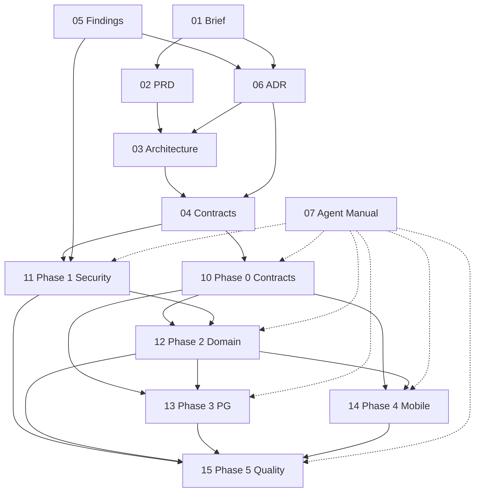
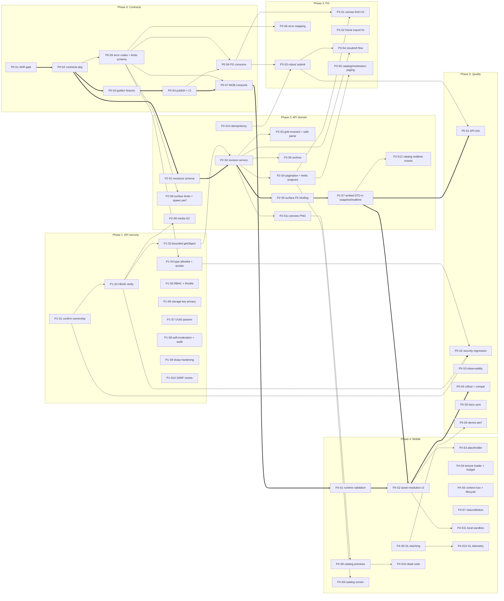

# Sprite Pipeline: план рефакторинга до production-ready (BMAD pack)

> **Статус пакета:** v1.0, сформирован 2026-10-01 по коду веток `master` трёх репозиториев.
> **Роль документа:** точка входа для людей и ИИ-агентов. Здесь описано, какие документы существуют, в каком порядке их читать и какие работы нельзя начинать без других.
> **Оркестратор:** этот пакет. Агенты-исполнители получают задачи только из файлов `10-*` ... `15-*` и отчитываются в `90-STATUS-BOARD.md`.

Репозитории:

| Код | Репозиторий | Стек | Роль |
|-----|-------------|------|------|
| `MOB` | [LarceRR/Twilite](https://github.com/LarceRR/Twilite) | Expo 57 / RN 0.86 / expo-gl / React Query / Zustand | Каталог, размещение, рендер спрайтов на Space |
| `API` | [LarceRR/twilite-backend](https://github.com/LarceRR/twilite-backend) | NestJS 11 + Fastify + Drizzle + zod 4 + Sharp + R2 | Медиа, модерация, каталог, поверхность |
| `PG` | [LarceRR/twilite-pg](https://github.com/LarceRR/twilite-pg) | Vite 8 / React 19 / Zustand | Редактор, упаковка TPO, загрузка, модерация UI |

---

## 1. Карта документов

| Файл | BMAD-артефакт | Для кого | Что содержит | Зависит от |
|------|---------------|----------|--------------|------------|
| [`01-PROJECT-BRIEF.md`](./01-PROJECT-BRIEF.md) | Project Brief (Analyst) | все | Проблема, цели, границы, метрики успеха, ответы на открытые вопросы аудита | - |
| [`02-PRD.md`](./02-PRD.md) | PRD (PM) | все | Функциональные (FR) и нефункциональные (NFR) требования с ID, эпики | 01 |
| [`03-ARCHITECTURE.md`](./03-ARCHITECTURE.md) | Architecture (Architect) | Dev, QA | As-is и to-be архитектура, модель данных, потоки, бюджеты производительности | 01, 02, 06 |
| [`04-CONTRACTS.md`](./04-CONTRACTS.md) | Interface spec (Architect) | Dev всех репо | **Жёсткие контракты** между проектами: схемы, инварианты, коды ошибок, лимиты, версии, фикстуры | 03, 06 |
| [`05-FINDINGS-REGISTER.md`](./05-FINDINGS-REGISTER.md) | Risk / issue register (QA) | Dev, QA | Проверенные по коду находки (SEC/COR/PERF/MNT) с доказательствами и ссылкой на story | - (исходные данные) |
| [`06-ADR-LOG.md`](./06-ADR-LOG.md) | Architecture Decision Records | Architect, Dev | Принятые решения и их альтернативы. Меняются только через новый ADR | 01, 05 |
| [`07-AGENT-OPERATING-MANUAL.md`](./07-AGENT-OPERATING-MANUAL.md) | Dev/SM workflow | **каждый агент** | Как брать story, ветки, DoD, формат отчёта, стоп-условия | - |
| [`10-PHASE-0-CONTRACTS-FOUNDATION.md`](./10-PHASE-0-CONTRACTS-FOUNDATION.md) | Epic + Stories | Dev (API, затем PG/MOB) | Пакет `@twilite/contracts`, фикстуры, CI drift-check | 04, 06 |
| [`11-PHASE-1-BACKEND-SECURITY.md`](./11-PHASE-1-BACKEND-SECURITY.md) | Epic + Stories | Dev (API) | IDOR, проверка загрузок, квоты, RBAC, лимиты, SSRF | 04, 05 (частично 10) |
| [`12-PHASE-2-BACKEND-DOMAIN-INTEGRITY.md`](./12-PHASE-2-BACKEND-DOMAIN-INTEGRITY.md) | Epic + Stories | Dev (API) | Ревизии, FK привязки, embed DTO в snapshot, пагинация, архив, GC, превью | 10, 11 |
| [`13-PHASE-3-PG-AUTHORING.md`](./13-PHASE-3-PG-AUTHORING.md) | Epic + Stories | Dev (PG) | Контракты в редакторе, лимит холста, надёжная отправка, ресабмит | 10, 12 |
| [`14-PHASE-4-MOBILE-RUNTIME.md`](./14-PHASE-4-MOBILE-RUNTIME.md) | Epic + Stories | Dev (MOB) | Runtime-валидация, резолв ассетов, GL-батчинг, текстурный бюджет, fallback, чистка | 10, 12 (частично независимы) |
| [`15-PHASE-5-QUALITY-RELEASE.md`](./15-PHASE-5-QUALITY-RELEASE.md) | QA / Release | QA, Dev | E2E, security regression, наблюдаемость, rollout и совместимость | 11-14 |
| [`90-STATUS-BOARD.md`](./90-STATUS-BOARD.md) | Sprint status | SM, все агенты | Таблица статусов всех stories | все |

### Порядок чтения для агента

1. `07-AGENT-OPERATING-MANUAL.md` (обязательно, правила работы).
2. `04-CONTRACTS.md` (обязательно, нельзя нарушать).
3. `06-ADR-LOG.md` (обязательно, почему так).
4. Файл фазы с вашей story.
5. Записи в `05-FINDINGS-REGISTER.md`, на которые ссылается story.
6. `03-ARCHITECTURE.md` по необходимости (разделы, указанные в story).

---

## 2. Граф зависимостей документов

---

## 3. Граф зависимостей работ (story-level)

Жирный путь = критический путь. Story без входящих стрелок можно начинать сразу.

### 3.1 Таблица «нельзя без»

| Story | Нельзя начинать без | Почему |
|-------|---------------------|--------|
| P0-S2 | P0-S1 | Пакет кодирует решения ADR-001, ADR-011, ADR-012 |
| P0-S6 / P0-S7 | P0-S4 | Клиентам нужен опубликованный пакет |
| P1-S2 | P1-S1 | Верификация живёт внутри исправленного confirm |
| P1-S3 | P1-S2 | Использует `StoragePort.headObject` из P1-S2 |
| P1-S4 | P0-S5 | Коды ошибок `MEDIA_*` и схема лимитов из пакета |
| P2-S1 | P0-S2 | Схемы ревизий в пакете |
| P2-S2 | P2-S1, P1-S3 | Нужна таблица ревизий и ограниченная загрузка PNG |
| P2-S6 | P2-S2 | FK ссылается на объект, у которого есть `published_revision_id` |
| P2-S7 | P2-S6 | Embed строится по FK-колонке |
| P2-S9 | P1-S2 | GC опирается на state machine медиа (`pending/ready/rejected`) |
| P2-S11 | P2-S2 | Превью генерируется при submit ревизии |
| P3-S1 | P0-S6, P2-S4 | Лимиты берутся с `GET /tpg/pixel-objects/limits` |
| P3-S3 | P0-S6, P2-S10 | Idempotency-Key на сервере |
| P3-S4 | P2-S2, P3-S3 | Новая семантика resubmit (живая ревизия не пропадает) |
| P4-S2 | P4-S1, P2-S7 | Резолв через embed + валидированный DTO |
| P4-S8 | P2-S11 | Нужен `previewUrl` |
| P4-S10 | P4-S8 | `PixelSheetPreview` удаляется только после замены превью |
| P5-S1 | P2-S7, P3-S3 | E2E проверяет полный путь новой архитектуры |
| P5-S4 | P4-S2 | План совместимости зависит от окна поддержки старых клиентов |

### 3.2 Что можно делать параллельно прямо сейчас (без ожидания Phase 0)

| Lane | Stories | Репо |
|------|---------|------|
| A: API security | P1-S1 -> P1-S2 -> P1-S3, P1-S5, P1-S6, P1-S7, P1-S8, P1-S9, P1-S10 | API |
| B: Contracts | P0-S1 -> P0-S2 -> ... | API |
| C: Mobile render | P4-S4, P4-S5, P4-S6, P4-S7, P4-S12 | MOB |
| D: PG UX | P3-S2 | PG |

---

## 4. Gates (контрольные точки)

| Gate | Условие прохождения | Кто подтверждает |
|------|---------------------|------------------|
| G0 Decisions | ADR-001...ADR-016 в статусе `Accepted` (или явный override владельца) | Владелец продукта (человек) |
| G1 Contracts frozen | `@twilite/contracts@1.x` опубликован, все три репо проходят fixture-тесты | Architect-агент + CI |
| G2 Backend secure | Все SEC-находки High/Critical закрыты, P5-S2 зелёный | QA-агент |
| G3 Domain migrated | Миграции 0008-0010 применены на staging, backfill-отчёт без ошибок | Dev API + человек |
| G4 Clients migrated | PG и MOB используют только пакет контрактов, старые типы удалены | QA-агент |
| G5 Production ready | Phase 5 закрыта, Definition of Ready (раздел 15) выполнен | Человек |

---

## 5. Глоссарий

| Термин | Значение |
|--------|----------|
| TPO | Twilite Pixel Object: PNG spritesheet + manifest `twilite.pixelobject/v1` |
| Pixel object | Запись каталога (`pixel_objects`), голова набора ревизий |
| Revision | Неизменяемая версия manifest + sheet (`pixel_object_revisions`, вводится ADR-003) |
| Live revision | Опубликованная ревизия, которую видят каталог и мобильный клиент |
| Surface object | Обитатель ячейки моста (`surface_objects`), kind = Fire/Cloud |
| Binding | Связь surface object -> pixel object (сейчас `metadata.pixelObjectId`, станет FK по ADR-004) |
| Mobile DTO | `PixelObjectMobileDto`: геометрия + анимация + `sheetUrl`, без служебных полей |
| Embed | Mobile DTO, вложенный сервером в surface object в snapshot и realtime |
| Golden fixtures | Канонические JSON/PNG примеры в пакете контрактов, против которых тестируются все три репо |
| S1...S11 | Стадии жизненного цикла из аудита (см. 03-ARCHITECTURE §2) |
