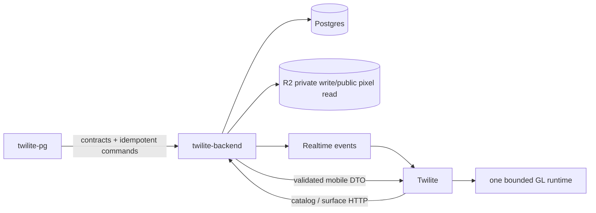

# 03. Target Architecture

## 1. Principles

1. API is authoritative for identity, moderation, placement and limits. Clients may optimize UX, never authorize.
2. A published pixel object is immutable. A new upload is a new revision; existing placements never point at a mutable pending row.
3. Cross-repo contracts are generated/published once, runtime-validated at boundaries, and fixture-tested in all consumers.
4. Rendering is a bounded cache, not an unbounded mirror of the catalog.
5. Every failure is observable with a stable code and a user-safe message.

## 2. Target components

`pixel_objects` becomes the logical head; `pixel_object_revisions` stores immutable manifest, sheet media, validation hash, preview and publication timestamps. `surface_objects.pixel_object_id` is nullable for procedural Fire/Cloud fallback and references the logical object. The placement resolves the current published revision, while a cached embedded DTO includes `revision`.

## 3. Lifecycle state machines

### Media
`pending -> ready -> consumed|orphaned -> deleted`; invalid confirm: `pending -> rejected`; no transition may skip ownership and storage verification.

### Pixel object
`draft(client only) -> pending -> published|rejected`; resubmit creates a new revision in `pending`, never hides the current published revision. `archived` removes catalog discoverability but keeps existing placements resolvable until migration policy says otherwise.

### Surface binding
`null -> published pixelObjectId` only at create. PATCH cannot change the binding. Delete/recreate is the explicit replacement operation.

## 4. Read paths

- Catalog: cursor page of published heads, each with current mobile DTO and preview URL.
- Surface snapshot: one surface query plus one batched revision query, no per-object HTTP call and no N+1 SQL.
- Realtime create/update: event contains the same validated surface DTO shape and optional embedded pixel DTO. Client still refetches on reconnect.
- Legacy mobile: `/mobile` remains during compatibility window; response is additive and includes `revision` when available.

## 5. Rendering design

`SpriteRuntime` owns one GL context, shader, static quad buffers, texture cache and load queue. The draw loop updates a single dynamic instance/vertex buffer per frame or uses one reusable quad buffer with uniforms. It must not call `createBuffer` or `deleteBuffer` inside sprite iteration. Texture cache uses URL+revision, byte estimate, LRU eviction, max 32 sheets and max 48 MiB. Load queue concurrency is 3, retry budget 3 with exponential backoff. Missing or failed assets render a kind placeholder and emit telemetry.

`reduceMotion`, app background and invisible screens stop animation RAF; static preview remains. Catalog cards use a static RN/image preview, not one GLView each.

## 6. Migration order

1. Publish contracts and fixture tests.
2. Harden media confirm and storage adapter.
3. Add revisions and backfill current rows as revision 1.
4. Add nullable surface FK and dual-read old metadata.
5. Backfill valid metadata bindings, quarantine invalid IDs, then enforce create validation.
6. Add embedded DTO and mobile dual-read.
7. Migrate PG and MOB writes/reads, then remove legacy copies.
8. Remove dead renderer paths only after device regression and one release window.

## 7. Operational budgets

| Budget | Target |
|---|---:|
| sheet accepted | <= 8 MiB, <= 160x160 frame, <= 64 frames |
| surface objects | <= configured 500 by default |
| mobile texture cache | <= 32 unique / <= 48 MiB estimated |
| texture downloads | 3 concurrent, 3 retries |
| GL paint | p95 <= 8 ms / 50 sprites |
| API snapshot | p95 <= 150 ms / 500 objects |
| sheet validation | p95 <= 300 ms, bounded memory |
